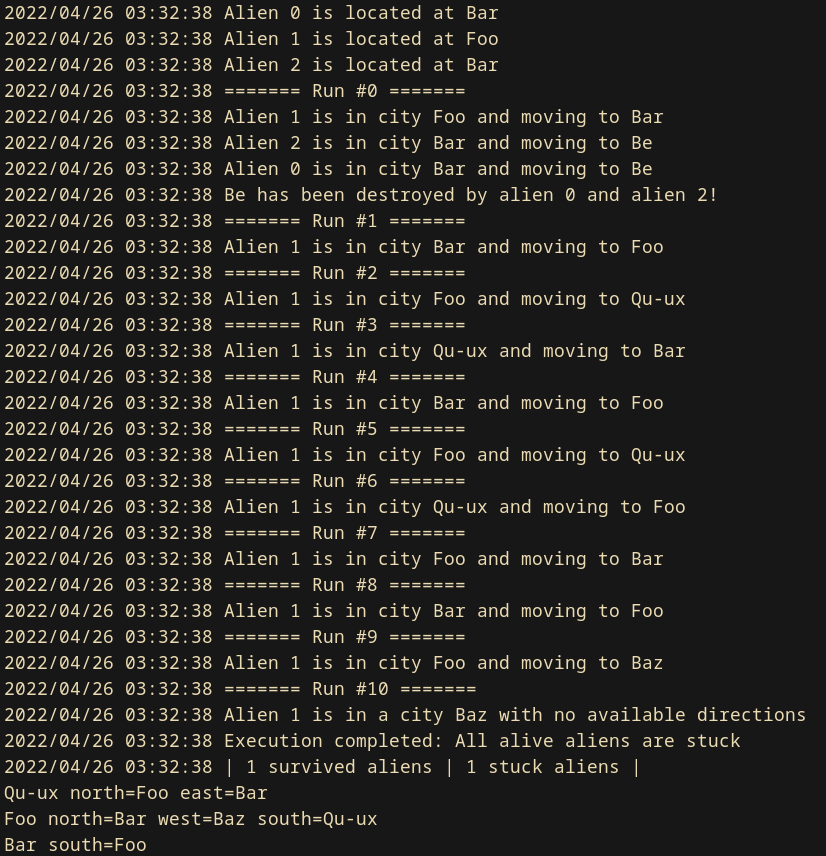

# Mad Aliens




Mad Alien is a simple alien life simulation tool. It is entirely written in Golang and it's a useful exercise to practice programming skills.

During each execution round all the aliens move from one city to another, following the links between them. If two aliens move to the same city, they fight and the city gets destroyed.

## Comments and Annotations

- City names cannot contain spaces.
- The cities are linked each other through single direction paths. This means that, if `1` is linked to `2`, it does not means that `2` is linked to `1`.
- All the aliens rise at the same time and no fight gets engage before landing. This means that if alien `A` is located in city `1` and alien `B` moves to the same city, no fight is engaged till `A` next movement is evaluated.
- If all the aliens get stuck, the execution immediatelly complete.
- Two Github Actions check that the code results to be syntactically correct and that all the tests succeed.
- `Engine` and `World` packages are designed to have different responsibilities: the first one defines the way effects world's changes should cause, while the second one exposes methods and types to manage the aliens movements.

## Installation
**1**: Install Golang (version 1.18)

**2**: Build the binary (an example `cli` tool has been added to the current repository)
```sh
$ make build
```

**3**: Run the `cli` tool to test the package functionalities (it can be found at `./bin/cli/cli-${PLATFORM}`)
```
$ ./bin/cli/cli-linux
Usage of ./bin/cli/cli-linux:
  -i string
        input file to read world definition from
  -m int
        max number of rounds to run (default 10000)
  -n int
        number of aliens to deploy (default 10)
```

```
$ ./bin/cli/cli-linux -i .&assets/example_world.txt -n 3

2022/04/26 04:07:14 Alien 0 is located at Foo
2022/04/26 04:07:14 Alien 1 is located at Bar
2022/04/26 04:07:14 Alien 2 is located at Foo
2022/04/26 04:07:14 ======= Run #0 =======
2022/04/26 04:07:14 Alien 0 is in city Foo and moving to Qu-ux
2022/04/26 04:07:14 Alien 1 is in city Bar and moving to Be
2022/04/26 04:07:14 Alien 2 is in city Foo and moving to Baz
2022/04/26 04:07:14 ======= Run #1 =======
2022/04/26 04:07:14 Alien 0 is in city Qu-ux and moving to Foo
2022/04/26 04:07:14 Alien 1 is in city Be and moving to Qu-ux
2022/04/26 04:07:14 Alien 2 is in a city Baz with no available directions
2022/04/26 04:07:14 ======= Run #2 =======
2022/04/26 04:07:14 Alien 0 is in city Foo and moving to Baz
2022/04/26 04:07:14 Alien 1 is in city Qu-ux and moving to Bar
2022/04/26 04:07:14 Alien 2 is in a city Baz with no available directions
2022/04/26 04:07:14 Baz has been destroyed by alien 2 and alien 0!
2022/04/26 04:07:14 Execution completed: All alive aliens are stuck
2022/04/26 04:07:14 | 1 survived aliens | 2 stuck aliens |
Bar west=Be south=Foo
Qu-ux north=Foo east=Bar
Be south=Qu-ux west=Foo east=Bar
Foo south=Qu-ux north=Bar
```

## Testing
A small suite of tests had been written. In order to run it:
```
$ make test
go test ./...
?       github.com/AzraelSec/mad-aliens/cmd/cli [no test files]
?       github.com/AzraelSec/mad-aliens/pkg/alien       [no test files]
?       github.com/AzraelSec/mad-aliens/pkg/city        [no test files]
ok      github.com/AzraelSec/mad-aliens/pkg/engine      (cached)
?       github.com/AzraelSec/mad-aliens/pkg/utils       [no test files]
ok      github.com/AzraelSec/mad-aliens/pkg/world       (cached)
```